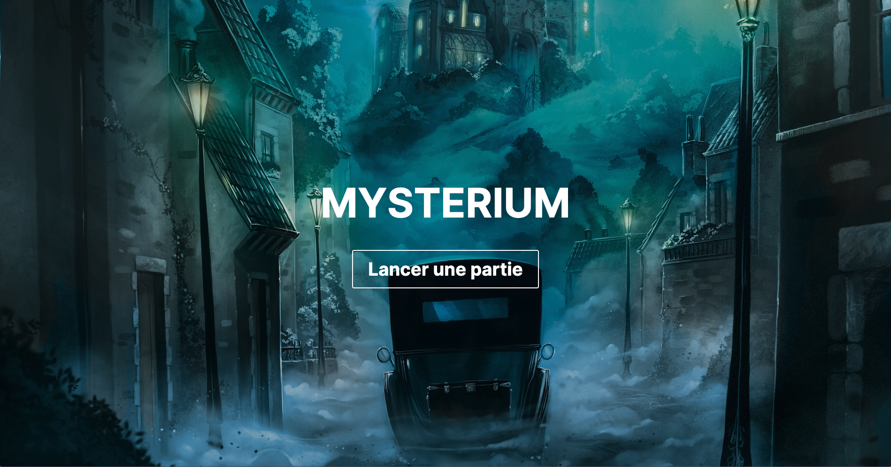

# Mysterium



## Introduction

Will you dare to cross the threshold of the Mysterium Manor ?

A ghost haunts the manor. Mystery shrouds the circumstances of its death. Mediums gather
to reconstruct the events of the night of the crime. They cannot succeed without the help of the ghost, whose 
visions are the only clues to uncover the truth. Time is of the essence : at dawn, the ghost will fade away forever !


## Disclaimer 

This project is in no way intended for commercialization or distribution. It is merely a personal project aimed at 
learning and improving my development skills.

## Dependencies

This project uses the following dependencies :

- [Next.js](https://nextjs.org/) - v14
- [React](https://reactjs.org/) - v18
- [Typescript](https://www.typescriptlang.org/) - v5
- [Lodash](https://lodash.com/) - v4
- [he](https://github.com/mathiasbynens/he) - v1
- [Prisma](https://www.prisma.io/) - v5
- [Axios](https://axios-http.com/) - v1
- [Bun](https://bun.sh) - v1
- [Jest](https://jestjs.io/) - v29
- [ts-jest](https://kulshekhar.github.io/ts-jest/) - v29
- [jest-mock-extended](https://www.npmjs.com/package/jest-mock-extended) - v3

## Installation

Clone or Unpack and copy folder to your wished location. Then from your console or command prompt go to the folder 
and **bun install** to install all dependencies.
You will need to create your own **.env** file with the following variables :
**DATABASE_URL=DBTYPE[^1]://USER:PASSWORD@HOST:PORT/DBNAME**


```bash
bun install
```

Quick commands to run the project :

```bash
bun dev
```

Quick commands to run the tests :

```bash
bun run test
```

or 

```bash
jest
```

## Production build
Just run **bun build** and **bun start** to build and run the project in production mode.

```bash
bun build
bun start
```

## Footnotes

[^1]: DBTYPE can be one of the following : MySQL, MongoDB, PostgreSQL, SQL Server, Planet Scale, CockroachDB
I invite you to refer to the [Prisma documentation](https://www.prisma.io/docs/getting-started/setup-prisma/add-to-existing-project/relational-databases-typescript-postgresql)
for more information on how to setup your database.
